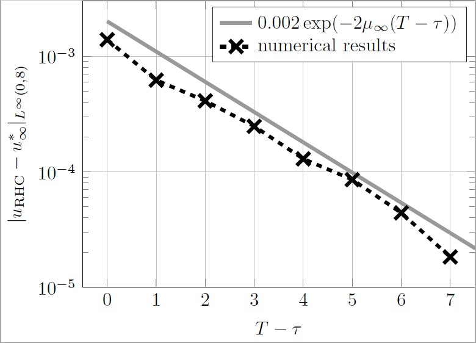

# Model Predictive Control
A simple implementation of Model Predictive Control (MPC) of unconstrained linear dynamics such as (discretized) wave and heat equations with quadratic cost functionals. 
This was used to do the numerical simulations in https://arxiv.org/abs/2206.01097. 

Main features:
* Comparison the MPC control to the inifnite horizon optimal control and the MPC limit (as defined in https://arxiv.org/abs/2206.01097).
* Imperfections in the plant model can be included. 
* Numerical validation of convergence rates for $(T-\tau, \tau) \rightarrow (\infty, 0)$.

Figure 1: MPC control obtained by running [MPC_wave_w.m](MPC_wave_w) with $(T-\tau, \tau) = (4, 1/16)$.

Figure 2: Norm of the state trajectory resulting from the application of the control in Figure 1. 

Figure 3: Numerical validation of the convergence rates for MPC when varying $T - \tau$

## Installation

Only requires a basic installation of MATLAB. 

Then run one of the following files. 
- [MPC_wave](MPC_wave) and [MPC_heat](MPC_heat): MPC without modeling errors (Receding Horizon Control, RHC) for discretized wave and heat equations. 
- [MPC_wave_A](MPC_wave_A) and [MPC_wave_w](MPC_wave_w): MPC with a modeling error in the A matrix and MPC with an additive disturbance. 
- [MPC_heat_conv](MPC_heat_conv): Convergence analysis of MPC without modeling errors (Receding Horizon Control, RHC) for $T-\tau \rightarrow \infty$. 
- [MPC_heat_A_conv](MPC_heat_A_conv) and [MPC_heat_w_conv](MPC_heat_w_conv): Convergence analysis of MPC for $\tau \rightarrow \infty$ with a modeling error in the A matrix and MPC with an additive disturbance. 
