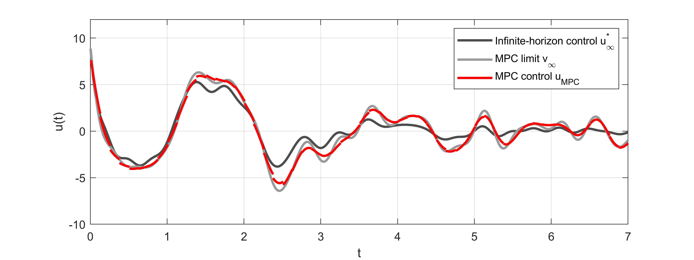
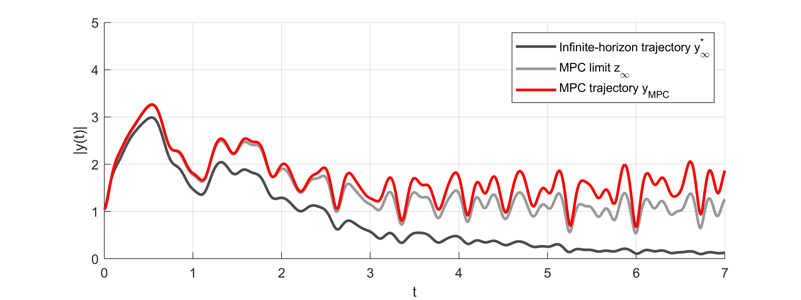
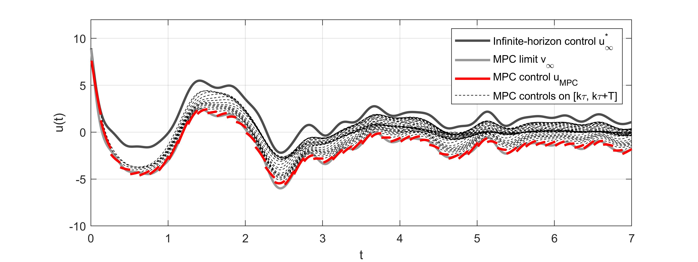
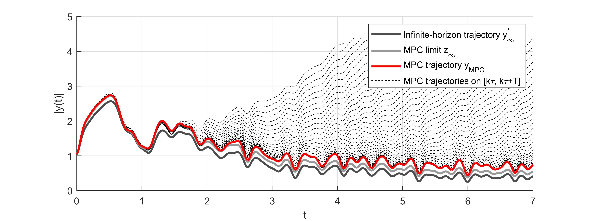
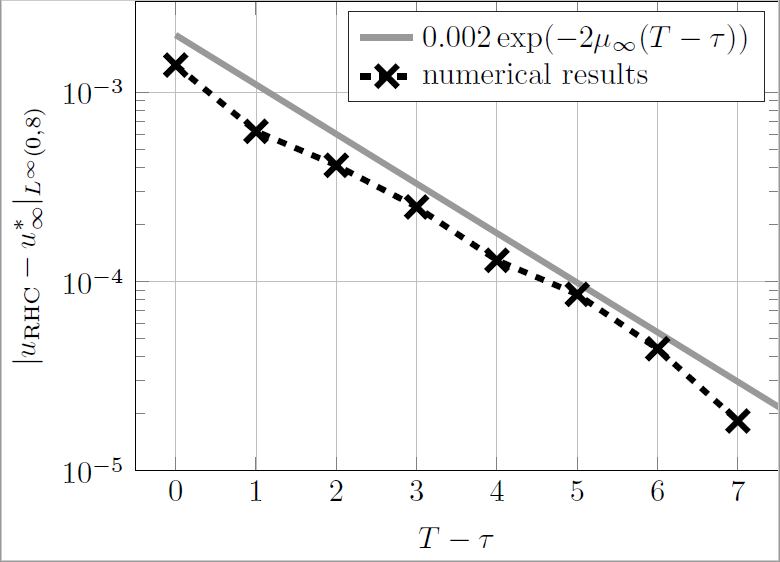
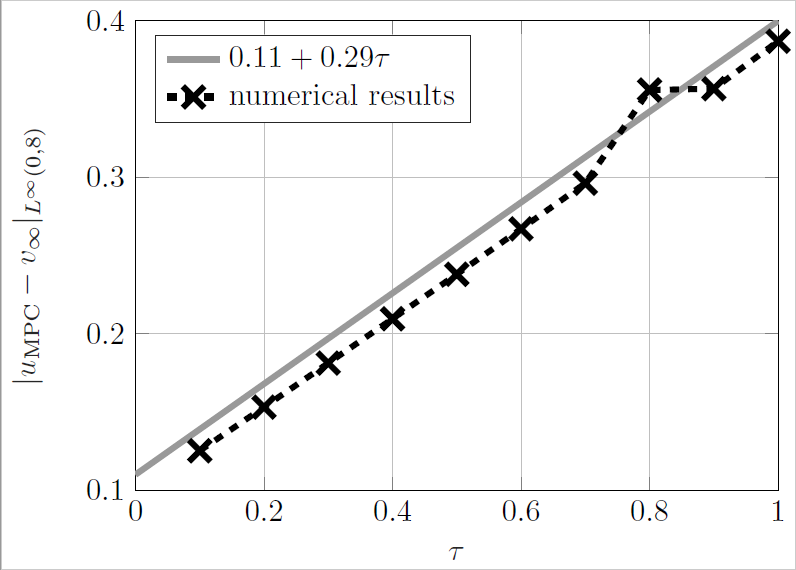
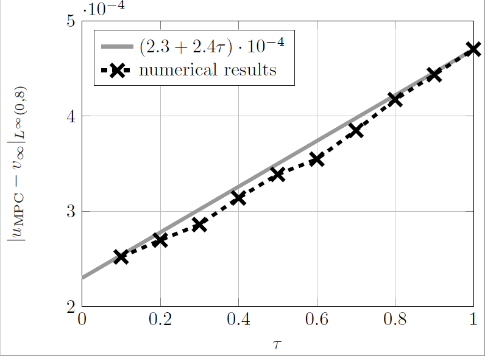

# Model Predictive Control
A simple implementation of Model Predictive Control of unconstrained linear dynamics such as (discretized) wave and heat equations with quadratic cost functionals. 

<!-- [MPC_wave](figures/MPC_T=41250_tau=1250.jpeg)
%[MPCX_wave](figures/MPCX_T=41250_tau=1250.jpeg)

%
% -->

